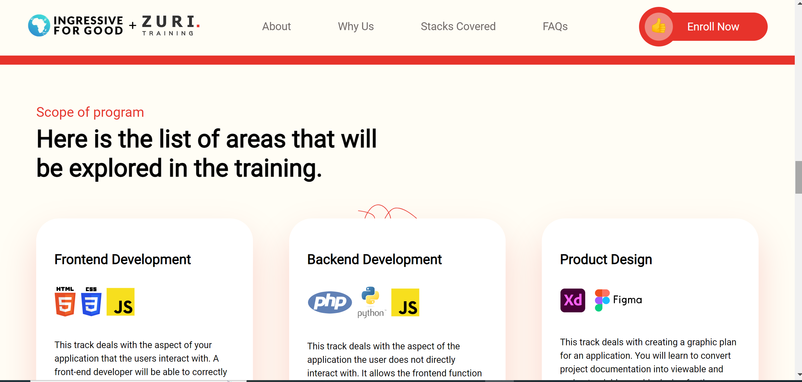
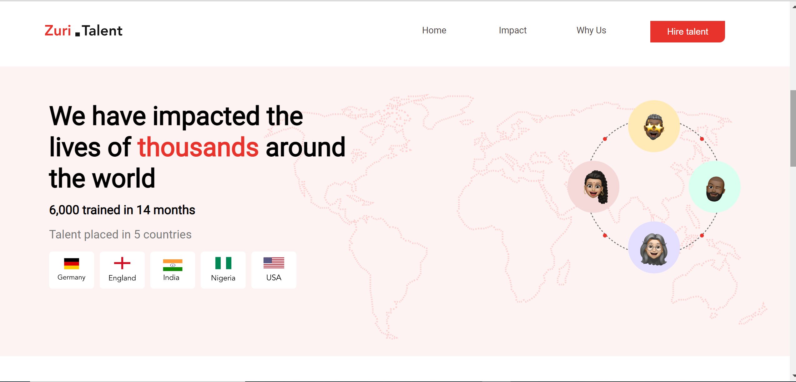

# Zuri Website Clone

I was given a final project at my internship to recreate three webpages of the [zuri website](https://zuri.team/)

## Table of contents

- [Overview](#overview)
  - [The challenge](#the-challenge)
  - [Screenshot](#screenshot)
  - [Links](#links)
- [My process](#my-process)
  - [Built with](#built-with)
  - [What I learned](#what-i-learned)
  - [Continued development](#continued-development)
  - [Useful resources](#useful-resources)
- [Author](#author)
- [Acknowledgments](#acknowledgments)

## Overview

The zuri website has multiple pages but this project requires just three of those projects. This is an interesting and brilliant way to test all that I was taught during the internship as the page includes using intermediate css skills and also javascript. The result of this project will be a measure of my programming skills at the moment.

### The challenge

Users should be able to:

- View the optimal layout for the site depending on their device's screen size
- See hover states for all interactive elements on the page
- Have good experiemce while usung the website
- Easy navigation and control
  -Smooth transitions of animations
- Beautiful colors that accentuate one another and are peasing to the users
- Pixel perfect

### Screenshot






### Links

- [Repo URL here](https://github.com/Rasheedatj/Zuri-Clone)
- [Live site URL](https://rasheedatj.github.io/Zuri-Clone/

## My process

My first step was examining the website I was to recreate, I checked the layout of the three pages and I made sketches of how to go about the layout of the page. Starting with the landing page I wrote the html for the page first then i procedded to stylinf it and then lastly I addad javascript functionalities. I used the same process for the other two pages except they were more tedious and hence needed extra work. I encountered little problem that required me going to seek answers from tutorials which I did I leanrt them for future purposes as well. I didnt work with the mobile first workflow so I stared working on the reepsonsiveness from the bigger viewports,this is the method I find easier. I concluded the project by carrying out a cross examination on all the pages and making correction where needed to the html, css and javascript.

### Built with

- Semantic HTML5 markup

  

- CSS custom properties

  

- Javascript

  .svg>)

### What I learned

- How to build an accordion
- Scroll padding property
- onclick event
- More on how to create a modal

```html
<div class="modal" id="myModal">
  <div class="modal-content">
    <h1>talent requirement</h1>
    <p>
      We will love to discuss your business <br />
      and your talent needs.
    </p>
    <div class="button">
      <a href="https://forms.gle/QFsTDVg2EhpY32Pd9">
        <button class="btn-1">Fill this form</button>
      </a>
      <p>or</p>
      <a href="https://calendly.com/zuri-team/consult-with-seyi?month=2022-04">
        <button class="btn-2">Book a Consultation</button>
      </a>
    </div>
  </div>
</div>
```

```css
.reasons > div {
  width: 30%;
  background-color: white;
  display: grid;
  place-items: center;
  padding: 2em 0;
  border-bottom-right-radius: 15px;
  color: #787878;
  font-size: 19px;
  line-height: 1.5;
  text-align: center;
  margin-bottom: 1em;
}
```

```js
let modal = document.querySelector(".modal");
let modalBtn = document.querySelectorAll(".pop");

modalBtn.forEach((popUp) =>
  popUp.addEventListener("click", () => {
    popUp.classList.add("pop");
    modal.style.display = "flex";
    modal.style.backgroundColor = "rgba(0, 0, 0, 0.7)";
  })
);
```

## Author

- LinkedIn - [Rasheedat](https://www.linkedin.com/in/rashedat-jinadu-066078227)

- Twitter - [@Rashedatj](https://www.twitter.com/Rashedatj)
